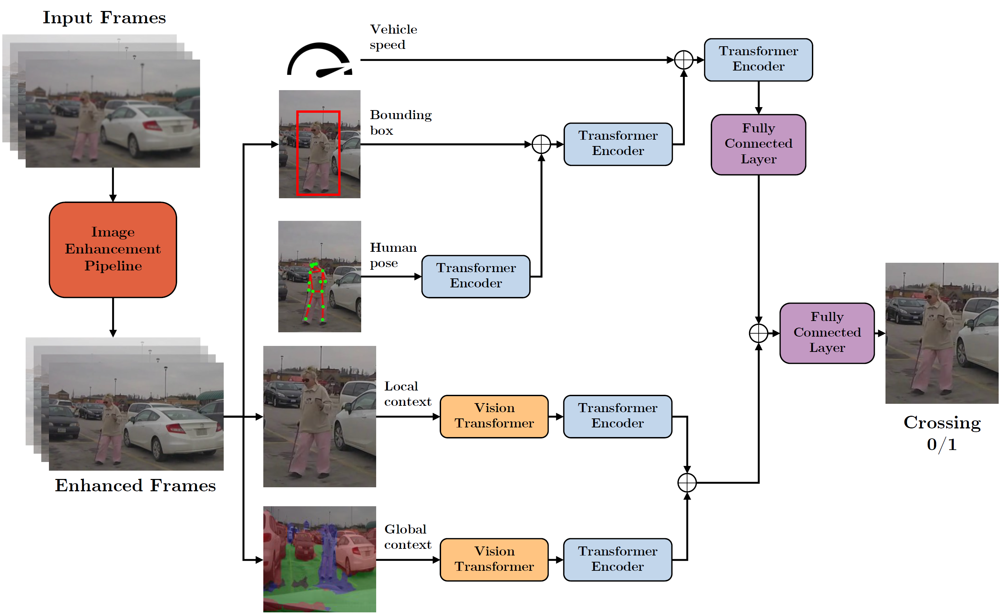
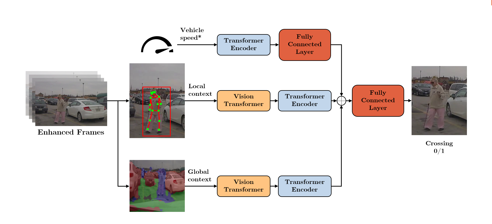

**Predicting Pedestrian Crossing Intentions in Adverse Weather with Self-Attention Models.**  

Our implementation relied on the pedestrian action prediction benchmark: `Kotseruba, Iuliia, Amir Rasouli, and John K. Tsotsos. "Benchmark for Evaluating Pedestrian Action Prediction." In Proceedings of the IEEE/CVF Winter Conference on Applications of Computer Vision, pp. 1258-1268, 2021.`

## DEMO

